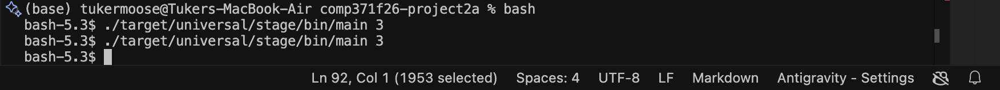
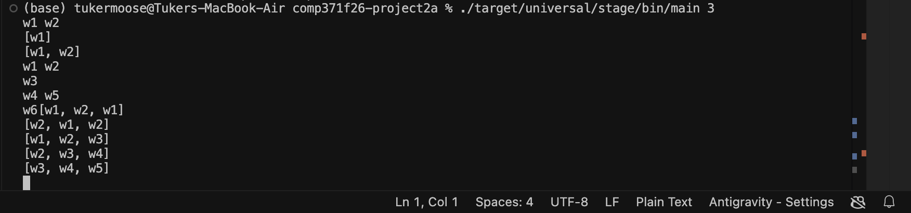
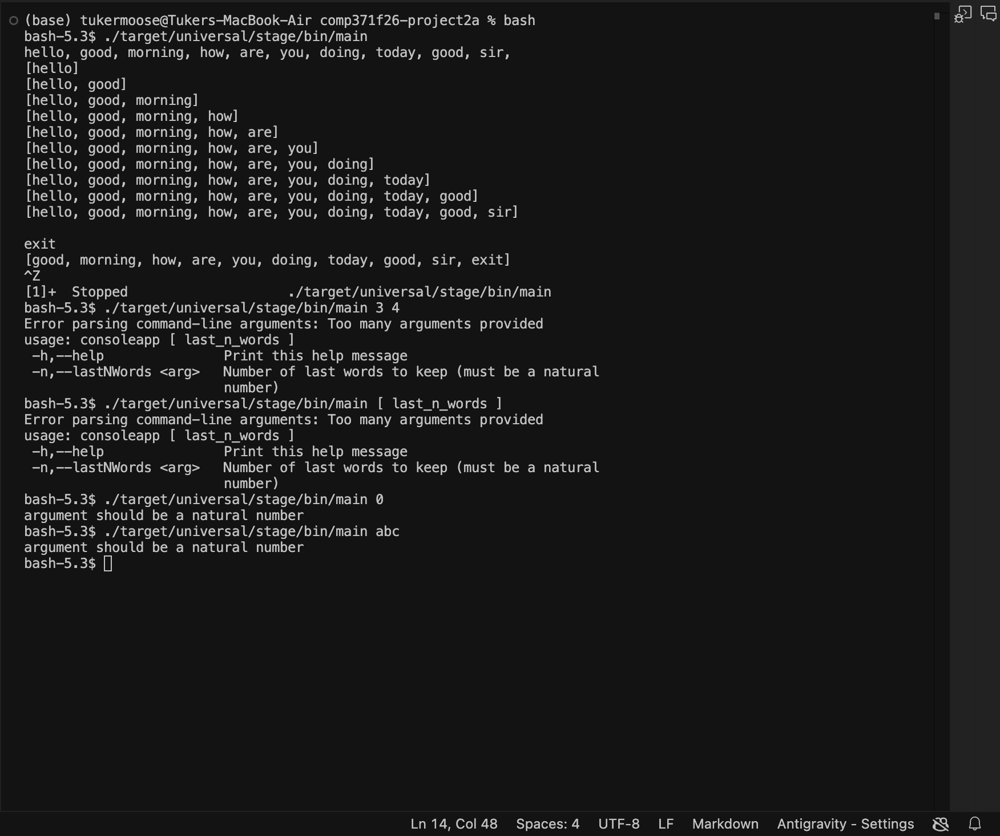

# Manual Testing Report

This document details the manual testing scenarios performed using the staged standalone binary (`sbt stage`), running outside sbt.

## Setup
Compile and stage the standalone application binary:
```bash
sbt stage
```
The executable is generated at `./target/universal/stage/bin/main`.

---

## Scenario 1: Empty Input (Ctrl-D immediately)

### Execution:
```bash
./target/universal/stage/bin/main 3
# Press Ctrl-D immediately
```

### Expected Behavior:
The application terminates immediately with exit code `0` and produces no output on stdout.

### Screenshot:


---

## Scenario 2: Nonempty Input (Matching README)

### Execution:
```bash
./target/universal/stage/bin/main 3
```

### Input and Output Trace:
```
w1 w2
[w1]
[w1, w2]
w3
[w1, w2, w3]
w4 w5
[w2, w3, w4]
[w3, w4, w5]
w6
[w4, w5, w6]
```
*(Press Ctrl-D to terminate input)*

### Expected Behavior:
- Correctly parses words delimited by non-alphanumeric whitespace/punctuation.
- Keeps a running FIFO sliding window queue of size 3.
- When capacity is exceeded, oldest elements are evicted in order.

### Screenshot:


---

## Scenario 3: Argument Validation

### No arguments (Default capacity 10):
```bash
./target/universal/stage/bin/main
```
Maintains up to 10 words in the sliding queue.

### Invalid arguments (> 1 argument):
```bash
./target/universal/stage/bin/main 3 4
```
**Output (stderr):**
```
usage: ./target/universal/stage/bin/consoleapp [ last_n_words ]
```
Exits with status `2`.

### Non-natural number:
```bash
./target/universal/stage/bin/main 0
./target/universal/stage/bin/main abc
```
**Output (stderr):**
```
argument should be a natural number
```
Exits with status `4`.

### Screenshot:

