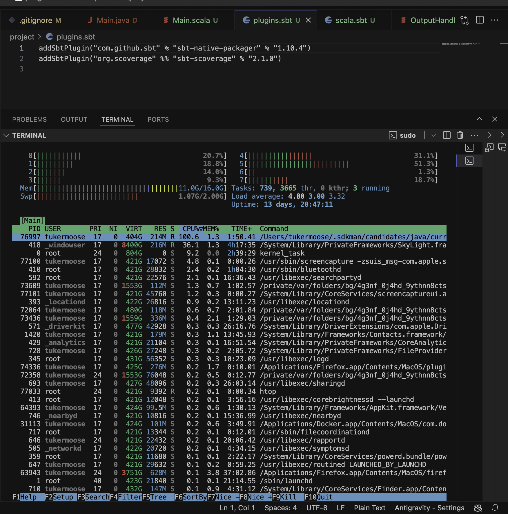
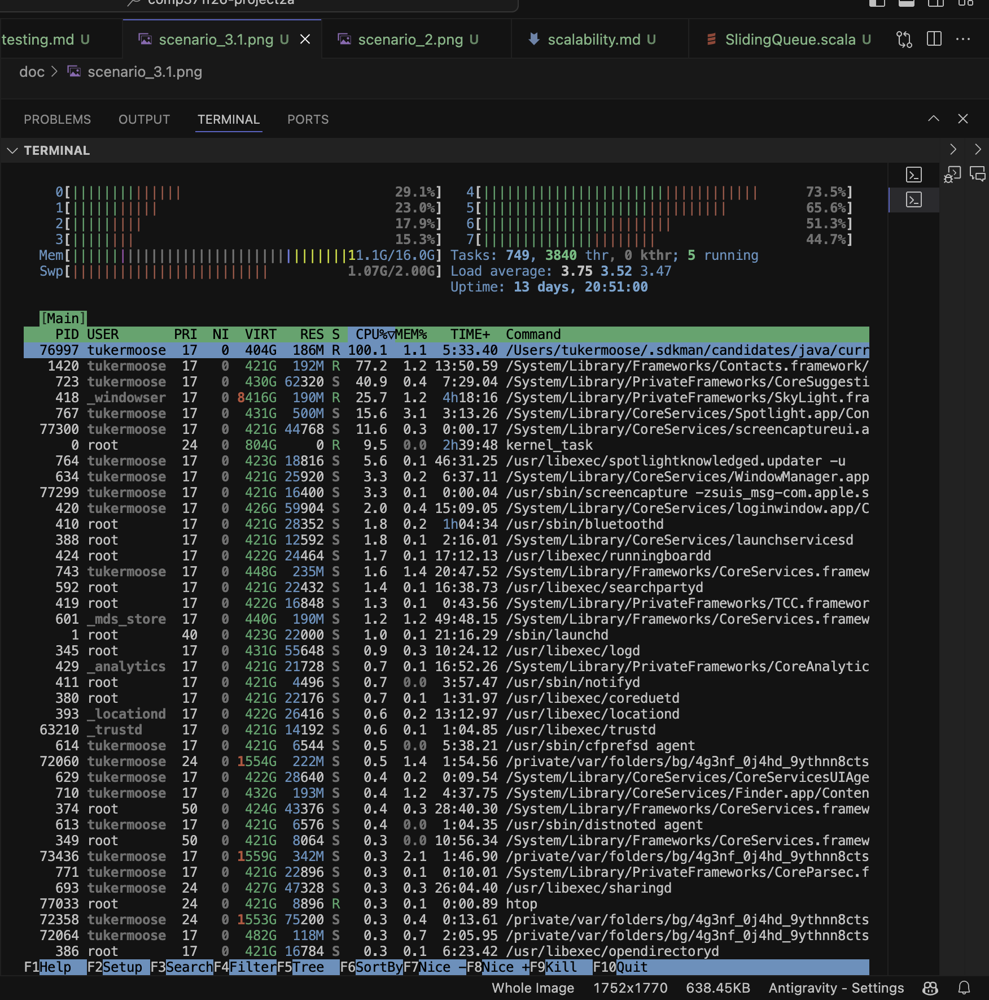

# Scalability Analysis and Memory Profiling

## Overview
A critical non-functional requirement for stream-processing pipelines handling potentially infinite/unbounded streams is **constant space complexity** ($O(1)$ memory).

If an application accumulates historical stream tokens (such as `MainLeaky.java`), the resident set size (RES) grows linearly with input size, eventually causing `OutOfMemoryError` or swapping.

In this implementation:
- `CircularFifoQueue` from Apache Commons Collections has a fixed, bounded capacity $N$.
- Once capacity is reached, inserting a new token automatically evicts the oldest element in $O(1)$ time.
- Standard input tokens are consumed stream-wise without retention.
- Output is written directly to standard output and flushed without buffering history.
- Hence, memory consumption is $O(N)$ with respect to queue capacity and $O(1)$ with respect to stream length.

---

## Profiling Instructions

### Terminal 1: Run with Infinite Input
Pipe infinite strings into the staged application and redirect stdout to `/dev/null`:
```bash
yes | ./target/universal/stage/bin/main > /dev/null
```

### Terminal 2: Monitor with `htop`
Run `htop` in another terminal:
```bash
htop
```
1. Sort by CPU usage (`F6` -> `PERCENT_CPU`).
2. Locate the Java process executing `edu.luc.cs.consoleapp.Main`.
3. Observe the `VIRT` (virtual memory) and `RES` (resident set size) columns.
4. Take two screenshots several minutes apart.

### Verification Criteria
- The `RES` and `VIRT` memory columns remain constant over time under indefinite load.
- No memory growth or leaks occur.

---

## Profiler Screenshots

### Initial Measurement ($T = 0$):


### Second Measurement ($T = 5\text{ minutes}$):

